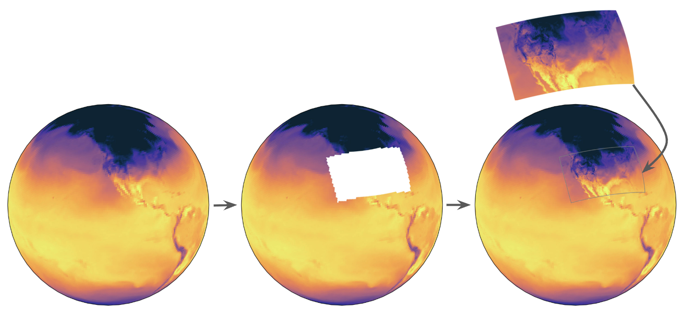

=================
nested-EAGLE
=================

:term:`EAGLE` currently includes a prototype nested-EAGLE model trained with
global :term:`GFS` data together with :term:`HRRR` data over the Contiguous
United States (CONUS).

This model builds on previous work from Met Norway (Nipen et al., 2024,
arXiv:2409.02891) by combining lower-resolution global data with
higher-resolution data over an area of interest.

.. centered:: Overview of the nested-EAGLE domain

nested-EAGLE configurations were provided by Tim Smith at NOAA Physical
Sciences Laboratory.

Training Data
------------------

The nested-EAGLE training dataset combines regridded global and regional
forecast data.

At a glance:

* :term:`GFS` is conservatively regridded to 1 degree.
* :term:`HRRR` is conservatively regridded to 15 km.
* The training period spans ``2015-02-01T06`` through ``2023-01-31T18``.
* The validation period spans ``2023-02-01T06`` through ``2024-01-31T18``.
* The testing period spans ``2024-02-01T06`` through ``2025-01-31T18``.

.. list-table:: nested-EAGLE input variables by category
   :widths: 20 80
   :header-rows: 1

   * - Category
     - Fields
   * - Prognostic
     - ``gh``, ``u``, ``v``, ``w``, ``t``, ``q``, ``sp``, ``u10``, ``v10``,
       ``t2m``, ``t_surface``, ``sh2``
   * - Diagnostic
     - ``u80``, ``v80``, ``accum_tp`` using ``fhr=6``
   * - Forcing
     - ``lsm``, ``orog``, ``cos_latitude``, ``sin_latitude``,
       ``cos_longitude``, ``sin_longitude``, ``cos_julian_day``,
       ``sin_julian_day``, ``cos_local_time``, ``sin_local_time``,
       ``insolation``

The vertical levels used in the dataset are ``100``, ``150``, ``200``,
``250``, ``300``, ``400``, ``500``, ``600``, ``700``, ``850``, ``925``, and
``1000``.

Model Architecture
------------------

The nested-EAGLE model uses the following architecture:

* Encoder and Decoder: Graph Transformer
* Processor: Sliding Window Transformer
* Latent mesh: four times coarser than the native data resolution

Near-Real-Time Forecasting
--------------------------

The nested-EAGLE model can be run in near real time (NRT) using the
``release/public-v1.1.0`` branch in this repository. That branch includes the required 
dependencies (including compatible ``anemoi`` versions) and is the recommended
starting point for NRT runs of nested-EAGLE.

To run NRT:

#. Check out the ``release/public-v1.1.0`` branch.

   .. code-block:: bash

      git checkout release/public-v1.1.0

#. Follow the :ref:`NRT workflow <NRT>`.

#. EPIC hosts the checkpoint on Azure. To download the checkpoint to your machine, simply run: 

   .. code-block:: bash

      wget -O inference-last.ckpt https://eaglecheckpoints.blob.core.windows.net/eagle-checkpoints/nested-eagle/inference-last.ckpt

Before running ``make realize``, update:

   * ``app.base`` to the absolute path of your local repository root
   * ``inference.anemoi.checkpoint_dir`` to the checkpoint you downloaded from Azure (inference-last.ckpt)

After those updates, realize the config and continue with the remaining quickstart
NRT steps.

EPIC runs this nested-EAGLE workflow in near-real-time every 6 hours. You can
view project information and current forecast results on the `NOAA EPIC website <https://www.epic.noaa.gov/ai/eagle-overview/>`_.
